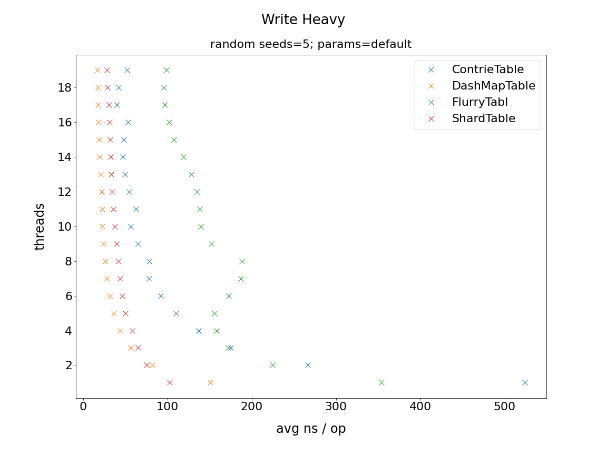

To generate the charts, use `python3 run.py`. This is a utility for comparing performance 
of various concurrent hashmap implementations in the crates.io ecosystem. See `src/main.rs`
for the routine, which currently runs each implementation over the presets in 
[`bustle::Mix`](https://docs.rs/bustle/0.4.1/bustle/struct.Mix.html) for 5 iterations/random
seeds. Lower numbers are better. Approaches using a single `std::sync` Lock and `chashmap`
were discarded for clarity (they are a lot slower). If you know why `chashmap` is so slow in
this test, please help here.

Here is some sample output using an Intel® Core™ i9-9820X

** Note `Flurry` is a partial run in the uniform workload due to OOM. `src/adapters.rs` uses the `flurry:HashMapRef`
which perhaps isn't clearing garbage between runs.

